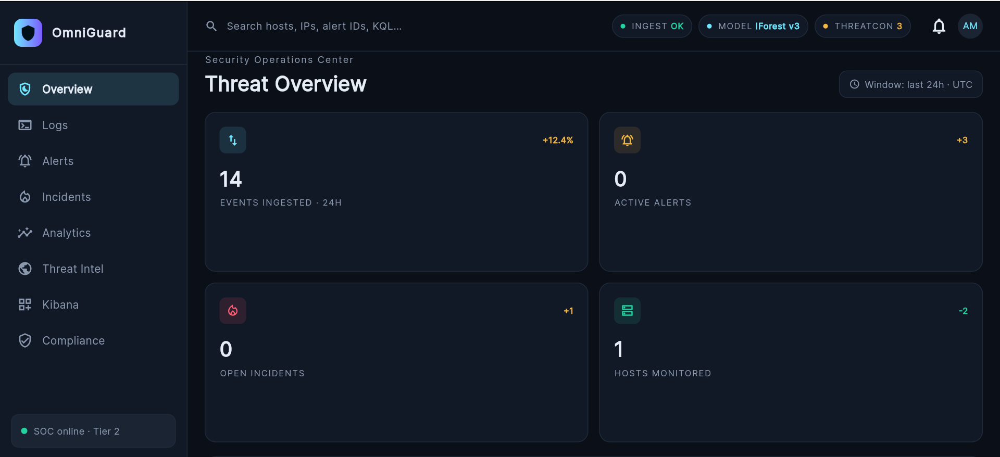
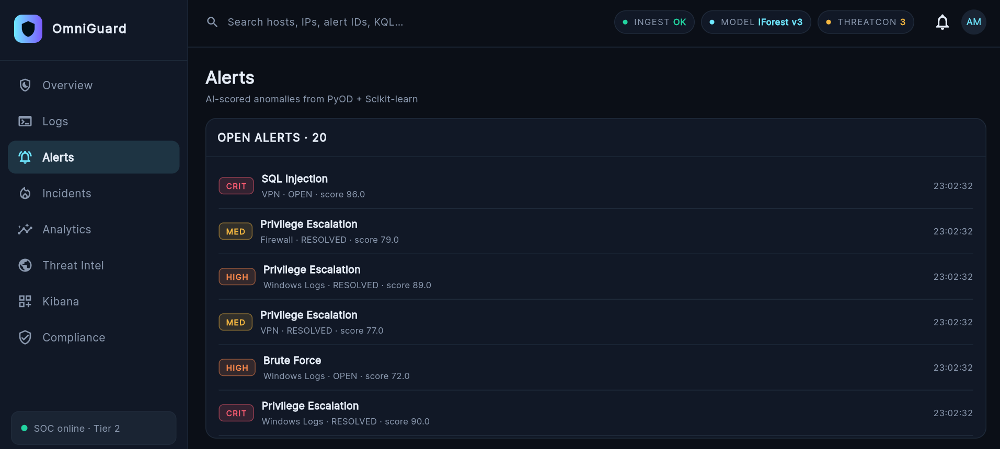
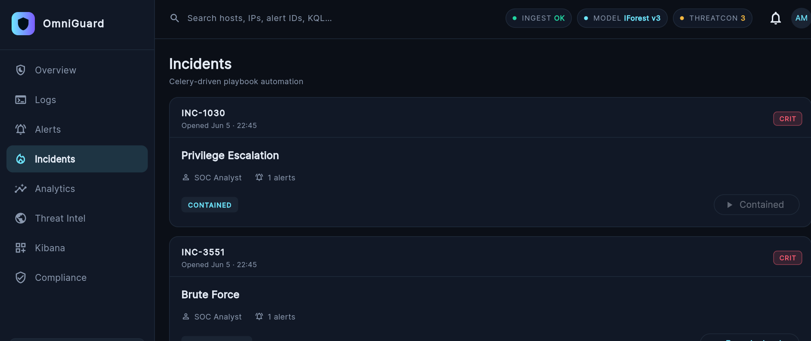
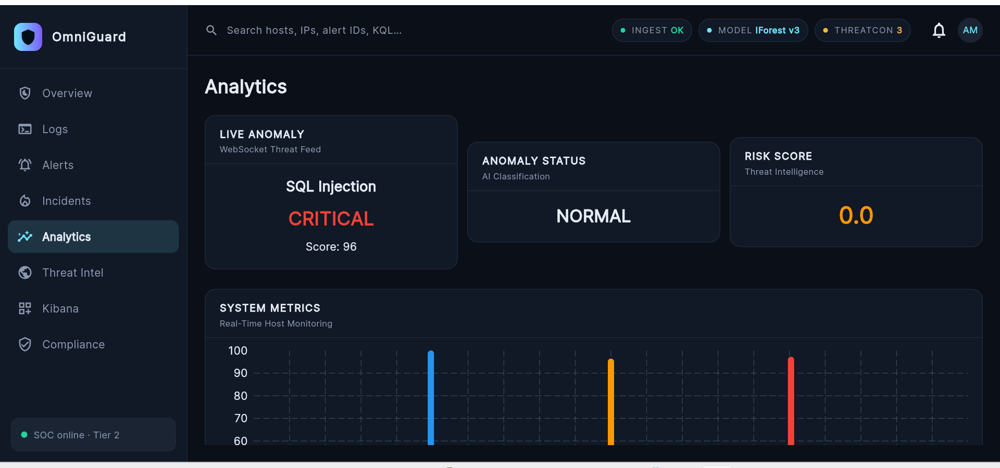
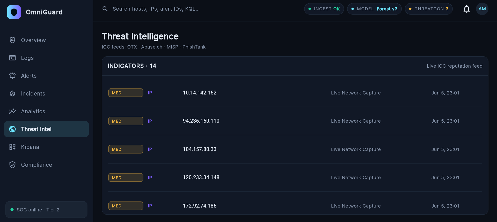
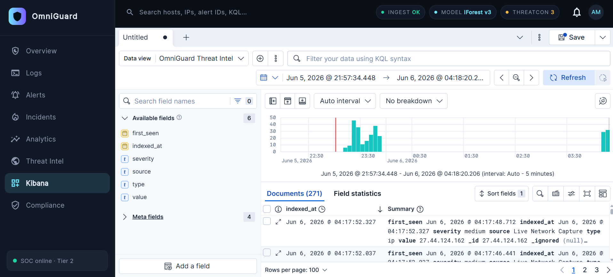
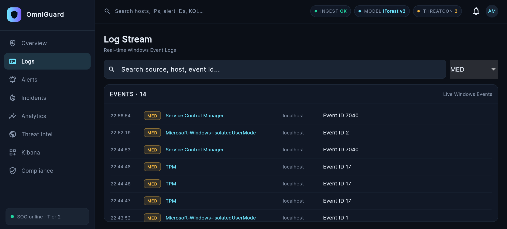
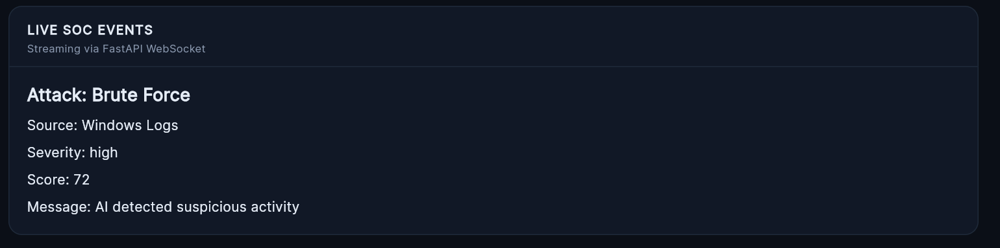

# OmniGuard — AI-Powered Security Operations Center

<p align="center">
  
</p>

<p align="center">
  
  
  
  
  
  
</p>

---

> **OmniGuard** is a full-stack, AI/ML-driven Security Operations Center platform inspired by enterprise SIEM systems like Splunk and IBM QRadar. It ingests real-time Windows Event Logs, scores threats using machine learning, correlates threat intelligence, and presents actionable intelligence through a purpose-built SOC dashboard — all in real time.

---

## Overview

Modern SOC teams are overwhelmed by alert volume and lack the tooling to correlate events intelligently. OmniGuard addresses this by combining a high-performance log ingestion pipeline, an ML anomaly detection engine, and a live SOC dashboard into a single, production-oriented platform.

The platform is designed for Tier 1–2 SOC analysts who need immediate situational awareness: real-time alert triage, incident lifecycle management, Kibana-native log exploration, and live threat intelligence correlation — all surfaced in a cybersecurity-optimized UI.

---

## Architecture

```
Windows Event Logs
        │
        ▼
  Logstash Collectors
        │
        ▼
   FastAPI Backend  ◄──── Threat Intel Feeds (OTX · Abuse.ch · MISP · PhishTank)
        │
        ├──── ML Anomaly Engine (PyOD · IsolationForest · Scikit-learn)
        │         └── Threat Scoring → Alert Generation
        │
        ├──── Elasticsearch Indices
        │         ├── omniguard-alerts
        │         ├── omniguard-incidents
        │         ├── omniguard-logs
        │         └── omniguard-threat-intel
        │
        ├──── Kibana Dashboards (embedded in Flutter via WebView)
        │
        └──── WebSocket / REST API
                  │
                  ▼
         Flutter Web SOC Dashboard
               ├── Overview
               ├── Log Stream
               ├── Alerts
               ├── Incidents
               ├── Analytics
               ├── Threat Intel
               └── Kibana Explorer
```

---

## Screenshots

| Overview | Alerts |
|---|---|
|  |  |

| Incidents | Analytics |
|---|---|
|  |  |

| Threat Intelligence | Kibana Integration |
|---|---|
|  |  |

| Log Stream | Live SOC Events |
|---|---|
|  |  |

---

## Core Features

### AI/ML Detection Engine
- **Isolation Forest** anomaly detection via PyOD and Scikit-learn
- Real-time threat scoring (0–100) with severity classification (INFO / LOW / MED / HIGH / CRIT)
- Continuous model inference against live event streams
- Anomaly status classification with AI confidence scoring
- System metrics correlation for behavioral baseline detection

### Log Ingestion & Indexing
- Real-time Windows Event Log collection via Logstash
- Structured ingestion into Elasticsearch with custom index mappings
- Field-level metadata: `source`, `host`, `event_id`, `severity`, `timestamp`
- Live log streaming with 5-minute auto-interval analysis windows
- Source-level volume tracking across collectors

### Alerts Management
- AI-scored alert feed with PyOD + Scikit-learn classification
- Alert severity filtering (CRIT / HIGH / MED)
- Open/resolved state tracking per alert
- KQL-based search across hosts, IPs, alert IDs
- Live alert feed streaming from anomaly engine
- 314+ indexed alert documents with full field statistics

### Incident Management
- Celery-driven playbook automation engine
- Incident lifecycle: Investigating → Contained → Resolved
- One-click playbook execution per incident
- SOC Analyst assignment per incident
- Incident-alert correlation (alert count per incident)
- Full incident history in Elasticsearch (`omniguard-incidents` index)

### Kibana Integration
- Kibana Discover embedded natively inside Flutter WebView
- Four live data views: OmniGuard Alerts, Incidents, Threat Intel, Compliance
- KQL filtering directly from the Flutter UI
- Auto-interval time-series charts (5-minute buckets)
- Field statistics and document drill-down

### Threat Intelligence
- Live IOC reputation feed from OTX · Abuse.ch · MISP · PhishTank
- 271 indexed threat intel documents across IP, domain, and hash indicators
- Severity-tagged indicators with source attribution
- Live Network Capture correlation with Elasticsearch indexing
- Automated IOC-to-alert correlation pipeline

### SOC Dashboard
- THREATCON level indicator (1–5 scale)
- Live ingestion status (INGEST OK) and active ML model display
- Events-per-minute (events/min) live chart
- Severity breakdown donut chart (PyOD-scored over 24h)
- Top log sources bar chart (Windows Logs, Processes, EDR, Firewall, VPN)
- Live alert feed streaming from anomaly engine
- WebSocket-ready event streaming via FastAPI

---

## Tech Stack

| Layer | Technology |
|---|---|
| Frontend | Flutter Web, Riverpod, Material 3 |
| Backend | FastAPI, Python 3.11+, Celery |
| Database | Elasticsearch 8.x |
| Analytics | Kibana 8.x |
| ML/AI | PyOD, Scikit-learn, IsolationForest |
| Log Pipeline | Logstash |
| HTTP Client | Dio (Flutter) |
| Real-time | FastAPI WebSocket |
| Task Queue | Celery |
| Threat Intel | OTX, Abuse.ch, MISP, PhishTank |

---

## ML / AI Pipeline

```
Raw Event Stream
      │
      ▼
 Feature Extraction
 (event_id, source, host, frequency, deviation)
      │
      ▼
 IsolationForest (PyOD)
 contamination=auto, n_estimators=100
      │
      ▼
 Anomaly Score (0.0 – 1.0)
      │
      ▼
 Threat Score (0 – 100) ◄── Severity Multiplier
      │
      ├── Score < 40  → INFO
      ├── Score 40–59 → LOW / MED
      ├── Score 60–79 → HIGH
      └── Score 80+   → CRITICAL → Alert Created → Incident Triggered
```

The IsolationForest model (`IForest v3`) runs continuously against the live event stream. Each scored anomaly is indexed in Elasticsearch and surfaced on the dashboard within seconds. The threat scoring engine applies source-weighted multipliers (EDR detections carry higher weight than firewall noise) to reduce false-positive fatigue.

---

## Cybersecurity Use Cases

- **Brute Force Detection** — Frequency-based anomaly scoring against authentication event sequences
- **Privilege Escalation** — Behavioral deviation detection on token/permission events
- **SQL Injection** — Source-pattern correlation on VPN and application log streams
- **Credential Stuffing** — Velocity-based detection across authentication sources
- **Lateral Movement** — Cross-host event correlation and IOC matching
- **Live IOC Correlation** — Real-time IP/domain reputation checks against threat intel feeds

---

## API Overview

| Method | Endpoint | Description |
|---|---|---|
| `GET` | `/api/alerts` | Fetch all scored alerts |
| `GET` | `/api/alerts/{id}` | Get alert detail |
| `PATCH` | `/api/alerts/{id}/status` | Update alert status |
| `GET` | `/api/incidents` | List all incidents |
| `POST` | `/api/incidents/{id}/playbook` | Trigger playbook execution |
| `GET` | `/api/logs/stream` | Real-time log stream |
| `GET` | `/api/threat-intel` | Fetch IOC indicators |
| `GET` | `/api/analytics/metrics` | System metrics snapshot |
| `GET` | `/api/analytics/anomaly` | Current anomaly status |
| `WS` | `/ws/soc-events` | WebSocket live SOC event feed |

All endpoints return structured JSON. Alert and incident data is simultaneously indexed into Elasticsearch for Kibana exploration.

---

## Setup & Installation

### Prerequisites

- Python 3.11+
- Flutter 3.x (Web enabled)
- Elasticsearch 8.x
- Kibana 8.x
- Docker & Docker Compose (recommended)

### 1. Clone the Repository

```bash
git clone https://github.com/yourusername/omniguard.git
cd omniguard
```

### 2. Start Elasticsearch & Kibana

```bash
docker-compose up -d elasticsearch kibana
```

### 3. Backend Setup

```bash
cd backend
python -m venv venv
source venv/bin/activate
pip install -r requirements.txt
uvicorn main:app --reload --host 0.0.0.0 --port 8000
```

### 4. Start Celery Worker

```bash
celery -A tasks.playbook_tasks worker --loglevel=info
```

### 5. Configure Logstash Pipeline

```bash
# Edit logstash/pipelines/windows_events.conf
# Set Elasticsearch output host
docker-compose up -d logstash
```

### 6. Flutter Web Frontend

```bash
cd frontend
flutter pub get
flutter run -d chrome --web-port 3000
```

### 7. Kibana Index Patterns

Import the dashboard objects from `kibana/dashboards/` via Kibana Stack Management → Saved Objects → Import.

### Environment Variables

```env
ELASTICSEARCH_HOST=http://localhost:9200
ELASTICSEARCH_INDEX_ALERTS=omniguard-alerts
ELASTICSEARCH_INDEX_INCIDENTS=omniguard-incidents
ELASTICSEARCH_INDEX_LOGS=omniguard-logs
ELASTICSEARCH_INDEX_THREAT_INTEL=omniguard-threat-intel
KIBANA_URL=http://localhost:5601
CELERY_BROKER_URL=redis://localhost:6379/0
ML_MODEL_PATH=ml/models/iforest_v3.pkl
```

---

## Future Enhancements

- **MITRE ATT&CK Mapping** — Correlate detected techniques to ATT&CK tactics automatically
- **Multi-Tenant SOC** — Role-based analyst workspaces with audit logging
- **Active Response Actions** — Host isolation, firewall rule push, and user lockout via playbooks
- **Graph-Based Entity Correlation** — Network graph of host/IP/user relationships
- **SOAR Integration** — Webhook-based integration with TheHive and Cortex
- **Custom ML Models** — Pluggable model registry supporting LSTM and AutoEncoder detectors
- **Mobile SOC App** — Flutter mobile client for on-call analyst alerting
- **Detection Rules Engine** — SIGMA rule import and live rule evaluation

---

## Inspiration

OmniGuard is inspired by the architecture and analyst workflows of enterprise-grade SIEM/SOAR platforms including **Splunk Enterprise Security**, **IBM QRadar**, **Microsoft Sentinel**, and **Elastic SIEM**. It brings similar detection and response capabilities into an open, extensible stack built on modern tooling.

---

## License

This project is licensed under the MIT License. See [LICENSE](LICENSE) for details.

---

<p align="center">
  Built for security engineers who demand real intelligence, not noise.
</p>